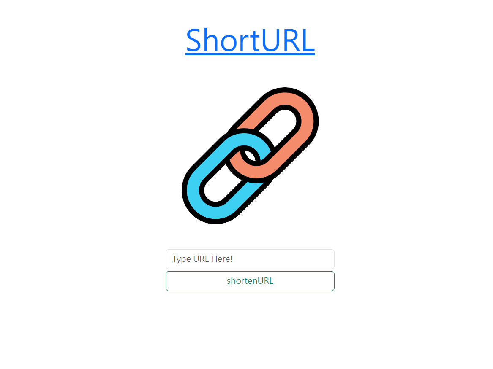

# 我的餐廳清單



此專案為 ALPHA Camp Dev C3 M6 指標作業所製作。  
運用 Node.js 建立本機伺服器，並透過 Express 與 Template Engine (Handlebars) 建立簡易的短網址產生器。

## 版本

- v1.0.0 (目前版本)

## 功能 (Features)

- 輸入原網址以取得短網址。
- 相同的原網址會產生相同的短網址。
- 點擊ShortURL可回到首頁。

## 執行環境 (RTE)

[Node.js](https://nodejs.org/) (v18.18.0)  
ℹ️ _執行此專案前，需安裝 Node.js。_

## 安裝 (Installation)

1. 開啟終端機 (Terminal)，cd 至存放本專案的資料夾，執行以下指令將本專案 clone 至本機電腦。

```
git clone https://github.com/yac0928/shortenURL.git
```

2. 進入此專案資料夾

```
cd shortenURL
```

3. 執行以下指令以安裝套件

```
npm install
```

4. 執行下列指令來啟動伺服器

```
npm run dev
```

當 Terminal 出現以下字樣，即代表伺服器啟動成功：  
`Express server is running on http://localhost:3000`  
現在，您可開啟任一瀏覽器輸入 http://localhost:3000 來使用餐廳清單網頁。

## 使用工具 (Tools)

- 開發環境：[Visual Studio Code](https://visualstudio.microsoft.com/zh-hant/)
- 應用程式框架：[Express 4.18.2](https://www.npmjs.com/package/express)
- 樣版引擎：[Express-Handlebars 7.1.2](https://www.npmjs.com/package/express-handlebars)
- 樣式框架：[Bootstrap](https://getbootstrap.com/docs/5.3/getting-started/download/)

## 開發者 (Contributor)

[Yuan Chen](https://github.com/yac0928)
